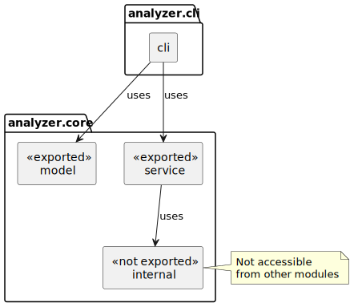

= Encapsulation – Hiding Implementation Details
ifdef::env-github[]
:tip-caption: :bulb:
:note-caption: :information_source:
:important-caption: :heavy_exclamation_mark:
:caution-caption: :fire:
:warning-caption: :warning:
endif::[]
:author: Gerd Aschemann
:revdate: 2026-03-12
:source-highlighter: rouge
:icons: font

[.lead]
In the xref:01-modular-basics.adoc[first article] (and its xref:02-modular-basics-homework.adoc[homework extension]), we built a modular Java project with Maven 4 and exported all packages from our core module.
What happens, though, when we have utility code that should stay hidden from other modules?
Java Modules provide _strong encapsulation_ to solve exactly this problem.

== The Problem: Leaking Implementation Details

In Blog 1, our core module exports both its packages:

[source,java]
----
module net.aschemann.maven.demos.analyzer.core {
    requires org.apache.logging.log4j;

    exports net.aschemann.maven.demos.analyzer.core.model;
    exports net.aschemann.maven.demos.analyzer.core.service;
}
----

This means every public class in `model` and `service` is part of the module's public API.
Other modules can depend on any of these classes, making it hard to change internal implementation details later.

Consider our `TextAnalyzer`: it contains text normalization logic – lowercasing, stripping punctuation, splitting into words – directly in its methods.
This normalization is an _implementation detail_ that other modules should not depend on.
If we extract it into a separate utility class, we want to ensure that only our core module can use it.

== Creating an Internal Package

We extract the normalization logic into a new class `TextNormalizer` in a dedicated `internal` package:

----
src/net.aschemann.maven.demos.analyzer.core/main/java/
├── module-info.java
└── net/aschemann/maven/demos/analyzer/core/
    ├── model/
    │   ├── Document.java
    │   └── Statistics.java
    ├── service/
    │   ├── TextAnalyzer.java
    │   └── DocumentReader.java
    └── internal/                    <1>
        └── TextNormalizer.java      <2>
----
<1> New package for internal implementation classes
<2> Text normalization utility – not exported

The `TextNormalizer` provides two methods:

[source,java]
----
public class TextNormalizer {

    private static final Pattern NON_WORD_CHARS = Pattern.compile("[^\\p{L}\\p{N}]");
    private static final Pattern WHITESPACE = Pattern.compile("\\s+");

    public static String normalize(String text) {
        String cleaned = NON_WORD_CHARS.matcher(text).replaceAll(" ");
        return WHITESPACE.matcher(cleaned).replaceAll(" ").trim().toLowerCase();
    }

    public static String[] tokenize(String text) {
        String normalized = normalize(text);
        if (normalized.isEmpty()) {
            return new String[0];
        }
        return WHITESPACE.split(normalized);
    }
}
----

The `normalize` method lowercases the text, removes all non-letter/non-digit characters, and collapses whitespace.
The `tokenize` method normalizes and then splits the text into individual words.
Both methods use Unicode-aware patterns (`+\p{L}+`, `+\p{N}+`) to handle text in any language.

Our `TextAnalyzer` now delegates to `TextNormalizer`:

[source,java]
----
import net.aschemann.maven.demos.analyzer.core.internal.TextNormalizer;
----

[source,java]
----
        String[] words = TextNormalizer.tokenize(content);
----

Within the same module, `TextAnalyzer` can freely use `TextNormalizer`.
The key question is: can _other_ modules access it too?

== Controlling Visibility with module-info.java

Here is the updated module descriptor for our core module:

[source,java]
----
module net.aschemann.maven.demos.analyzer.core {
    requires org.apache.logging.log4j; // <1>

    exports net.aschemann.maven.demos.analyzer.core.model; // <2>
    exports net.aschemann.maven.demos.analyzer.core.service; // <2>
    // Note: net.aschemann.maven.demos.analyzer.core.internal is NOT exported // <3>
}
----
<1> Dependency on Log4j for logging
<2> These packages are exported – other modules can use their public classes
<3> The `internal` package is deliberately _not_ exported

The `internal` package does not appear in any `exports` directive.
This single omission is what makes `TextNormalizer` invisible to every other module -- despite being a `public` class.

== Compile-Time Protection

What happens if the CLI module tries to import `TextNormalizer`?

[source,java]
----
// In AnalyzerCommand.java (CLI module)
import net.aschemann.maven.demos.analyzer.core.internal.TextNormalizer; // <1>
----
<1> This will not compile

The compiler rejects this with a clear error message:

----
error: package net.aschemann.maven.demos.analyzer.core.internal is not
    visible
  (package net.aschemann.maven.demos.analyzer.core.internal is declared
    in module net.aschemann.maven.demos.analyzer.core, which does not
    export it)
----

The module system enforces encapsulation at compile time.
You cannot accidentally depend on an internal class – the compiler prevents it.

== Runtime Protection

Java Modules go further than compile-time checks.
Even at runtime, the module system blocks access to non-exported packages.

If someone tries to use reflection to access `TextNormalizer` from another module:

[source,java]
----
// Attempting reflective access from the CLI module
Class<?> clazz = Class.forName(
    "net.aschemann.maven.demos.analyzer.core.internal.TextNormalizer"
);
----

The runtime throws:

----
java.lang.IllegalAccessError: class ... cannot access class
    net.aschemann.maven.demos.analyzer.core.internal.TextNormalizer
    (in module net.aschemann.maven.demos.analyzer.core) because module
    net.aschemann.maven.demos.analyzer.core does not export
    net.aschemann.maven.demos.analyzer.core.internal
----

This is what _strong encapsulation_ means: the boundary is enforced by the JVM itself, not just by the compiler.
No workaround, no trick, no reflection hack can bypass it.

[NOTE]
.`opens` vs. `exports`
====
If a module explicitly _opens_ a package (via the `opens` directive), reflective access is permitted.
This is how frameworks like picocli or Hibernate can access annotated classes.
However, `opens` is an explicit, deliberate choice by the module author – not something an external module can force.
====

== Comparison with the Classpath

On the traditional classpath, any `public` class is accessible from anywhere.
There is no way to hide implementation details at the language level.
Naming a package `internal` is merely a convention that developers can easily ignore.

[cols="1,1,1"]
|===
|Aspect |Classpath |Module Path

|Public class visibility
|Accessible from everywhere
|Only if the package is exported

|Internal packages
|Convention only (e.g., naming)
|Enforced by compiler and JVM

|Reflection access
|Always possible
|Blocked unless the package is opened

|Compile-time enforcement
|None
|Module system rejects illegal access
|===

Java Modules provide a fundamental improvement: you can define a clear public API for your module, and _everything else is hidden by default_.

== Updated Module Diagram

With the internal package, our module structure now looks like this:

The `internal` package is used by `service` within the same module, but the CLI module has no access to it.

== Source Code

The above changes are committed to the sample source code repository on https://github.com/aschemaven/maven-modular-sources-showcases[GitHub].
Clone it and switch to branch `blog-2-encapsulation`:

[source,bash]
----
git clone https://github.com/aschemaven/maven-modular-sources-showcases # unless already done
cd maven-modular-sources-showcases
git checkout blog-2-encapsulation
----

== Summary

In this article, we have seen:

* How to create internal packages that are hidden from other modules
* The module system enforces encapsulation at both compile time and runtime
* Even reflection cannot bypass strong encapsulation (unless explicitly opened)
* This is a fundamental improvement over the classpath, where `public` means accessible from everywhere

The pattern is straightforward: packages listed in `exports` are your public API.
Everything else is encapsulated.

== Homework

Qualified exports::
Try changing the `module-info.java` to use a _qualified export_:
+
[source,java]
----
exports net.aschemann.maven.demos.analyzer.core.internal
    to net.aschemann.maven.demos.analyzer.cli;
----
+
This makes the `internal` package accessible only to the CLI module, but not to any other module.
When would this be useful?
We will explore this further in a future article.

'''

Apache Maven and Maven are trademarks of the https://www.apache.org/[Apache Software Foundation].
