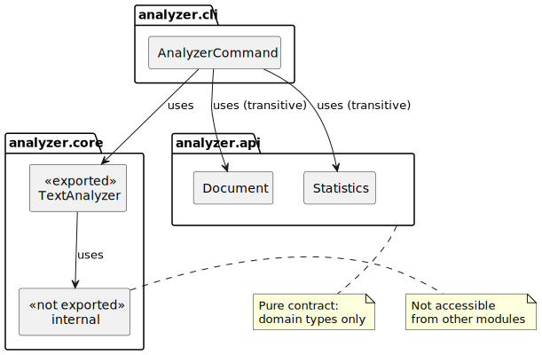

= Separating contract and implementation
ifdef::env-github[]
:tip-caption: :bulb:
:note-caption: :information_source:
:important-caption: :heavy_exclamation_mark:
:caution-caption: :fire:
:warning-caption: :warning:
endif::[]
:author: Gerd Aschemann
:revdate: 2026-03-26
:source-highlighter: rouge
:icons: font

[.lead]
The xref:03-encapsulation.adoc[previous article] showed how to hide implementation details using internal packages.
The core module still mixes two concerns, though: it exports both the domain model (`Document`, `Statistics`) and the service implementation (`TextAnalyzer`).
Consumers that only need the data types must depend on the entire implementation.
Java Modules provide an elegant solution: separate the domain types into their own module and use `requires transitive` to keep things convenient.

== The problem: Mixed concerns

After the xref:03-encapsulation.adoc[previous article], the core module looks like this:

[source,java]
----
module net.aschemann.maven.demos.analyzer.core {
    requires org.apache.logging.log4j;

    exports net.aschemann.maven.demos.analyzer.core.model;
    exports net.aschemann.maven.demos.analyzer.core.service;
}
----

The module exports both `model` — domain types — and `service` — implementation.
Any module that needs `Document` or `Statistics` must depend on `core` and transitively pulls in Log4j and the internal implementation.

This represents a common antipattern in modular design: mixing the _contract_ — what the module promises — with the _implementation_ — how it fulfills that promise.

== Introducing a contract module

The solution is a classic layering pattern: extract the domain types into a dedicated _API module_.
The implementation module then _depends on_ the API and provides concrete service classes.

The project now has three Java modules:

analyzer.api:: Pure contract — domain types, no dependencies
analyzer.core:: Implementation — depends on API transitively, provides service classes
analyzer.cli:: Consumer — depends on core, gains access to API types automatically via `requires transitive`

== The contract module

The new module contains the domain records `Document` and `Statistics`, moved from `core.model`.

=== Module descriptor

[source,java]
----
module net.aschemann.maven.demos.analyzer.api {
    exports net.aschemann.maven.demos.analyzer.api; // <1>
}
----
<1> Single export — all API types live in one package

The API module has _no dependencies_.
It is a pure contract that any module can depend on without pulling in implementation details.

The `Document` and `Statistics` types moved from `net.aschemann.maven.demos.analyzer.core.model` to `net.aschemann.maven.demos.analyzer.api`.

[NOTE]
.Moving `DocumentReader` logic into `Document`
====
In the xref:01-modular-basics.adoc[first] and xref:03-encapsulation.adoc[previous] articles, a separate `DocumentReader` class in the core module handled reading files from disk.
With the API/core split, `DocumentReader` remains in the core module — and any module that needs to read a `Document` from disk must depend on core.
This becomes a problem when consumers should depend only on the API.
The clean alternative — a `DocumentReader` interface in the API module with an implementation in core — would require its own service wiring and add complexity.

A pragmatic solution: move the file-reading logic into `Document` itself as factory methods.
The `Document` record gains `fromPath(Path)` for the common UTF-8 case, and `fromPath(Path, Charset)` for reading with a specific character encoding.

[source,java]
----
    /**
     * Reads a document from the given path using UTF-8 encoding.
     *
     * @param path the path to the file
     * @return a new Document instance
     * @throws IOException if the file cannot be read
     */
    public static Document fromPath(Path path) throws IOException {
        return fromPath(path, StandardCharsets.UTF_8);
    }

    /**
     * Reads a document from the given path using the specified charset.
     *
     * @param path the path to the file
     * @param charset the charset to use for reading
     * @return a new Document instance
     * @throws IOException if the file cannot be read
     */
    public static Document fromPath(Path path, Charset charset) throws IOException {
        if (!Files.exists(path)) {
            throw new IOException("File not found: " + path);
        }
        if (!Files.isRegularFile(path)) {
            throw new IOException("Not a regular file: " + path);
        }
        String content = Files.readString(path, charset);
        return new Document(path, content);
    }
----

This keeps the API module self-contained without introducing additional classes or service interfaces.

One trade-off: the old `DocumentReader` logged file paths via Log4j before and after reading.
The API module has no logging dependency, so these diagnostic messages are gone.
Callers that need logging can add it at the call site.
====

== The updated core module

The core module now _uses_ the API types rather than _defining_ them.

=== Module descriptor

[source,java]
----
module net.aschemann.maven.demos.analyzer.core {
    requires transitive net.aschemann.maven.demos.analyzer.api; // <1>
    requires org.apache.logging.log4j; // <2>

    exports net.aschemann.maven.demos.analyzer.core.service; // <3>
    // Note: net.aschemann.maven.demos.analyzer.core.internal is NOT exported // <4>
}
----
<1> `requires transitive` — any module that requires `core` automatically reads `api`
<2> Log4j is an implementation detail, required but not transitive
<3> Only the service package is exported
<4> The internal package remains encapsulated

The key change is `requires transitive net.aschemann.maven.demos.analyzer.api`.
This means the API types appear in core's exported signatures — `TextAnalyzer.analyze(Document)` returns `Statistics` — so consumers of core automatically need access to the API module.
The `transitive` keyword makes this explicit and automatic.

The `TextAnalyzer` class itself is unchanged — it still delegates to the internal `TextNormalizer` encapsulated in the xref:03-encapsulation.adoc[previous article].
Only its imports changed from `core.model.Document` to `api.Document`, and likewise for `Statistics`.

== How `requires transitive` works

The command-line module's descriptor has _not changed_ from the xref:03-encapsulation.adoc[previous article]:

[source,java]
----
module net.aschemann.maven.demos.analyzer.cli {
    requires net.aschemann.maven.demos.analyzer.core;
    requires info.picocli;
    requires org.apache.logging.log4j;

    opens net.aschemann.maven.demos.analyzer.cli to info.picocli;
}
----

The command-line module declares `requires net.aschemann.maven.demos.analyzer.core` — and because core declares `requires transitive net.aschemann.maven.demos.analyzer.api`, it can use `Document` and `Statistics` without an explicit `requires api` directive.

This is called _implied readability_: the transitive keyword propagates the dependency through the module graph.

Without `transitive`, the command-line module would need to declare:

[source,java]
----
module net.aschemann.maven.demos.analyzer.cli {
    requires net.aschemann.maven.demos.analyzer.core;
    requires net.aschemann.maven.demos.analyzer.api; // <1>
    requires info.picocli;
    requires org.apache.logging.log4j;

    opens net.aschemann.maven.demos.analyzer.cli to info.picocli;
}
----
<1> Would be required without `transitive` on core's dependency

=== What breaks without `transitive`?

If you remove the `transitive` keyword from core's module-info.java:

[source,java]
----
module net.aschemann.maven.demos.analyzer.core {
    requires net.aschemann.maven.demos.analyzer.api; // no transitive!
    // ...
}
----

The command-line module will fail to compile:

----
error: package net.aschemann.maven.demos.analyzer.api is not visible
  (package net.aschemann.maven.demos.analyzer.api is declared in module
    net.aschemann.maven.demos.analyzer.api, which is not in the module graph)
----

The compiler tells you exactly what's wrong: the API module is not in the command-line module's graph because core no longer transitively exports it.

== The updated project structure

With three modules, the directory structure looks like this:

----
pom.xml                                               <1>
src/
├── net.aschemann.maven.demos.analyzer.api/          <2>
│   └── main/java/
│       ├── module-info.java
│       └── net/aschemann/maven/demos/analyzer/api/
│           ├── Document.java
│           └── Statistics.java
├── net.aschemann.maven.demos.analyzer.core/         <3>
│   └── main/java/
│       ├── module-info.java
│       └── net/aschemann/maven/demos/analyzer/core/
│           ├── internal/
│           │   └── TextNormalizer.java
│           └── service/
│               └── TextAnalyzer.java
└── net.aschemann.maven.demos.analyzer.cli/          <4>
    └── main/java/
        ├── module-info.java
        └── net/aschemann/maven/demos/analyzer/cli/
            └── AnalyzerCommand.java
----
<1> Still _one and only_ Maven POM — now with three Java modules declared via `<sources>`.
    No extra per-module POMs even as the project grows.
<2> API module — domain types, no dependencies
<3> Core module — implementation, depends on API transitively
<4> Command-line module — consumer, unchanged module descriptor

== Updated POM configuration

The Maven POM now declares three module sources:

[source,xml]
----
        <sources>
            <source>
                <module>net.aschemann.maven.demos.analyzer.api</module> <!--1-->
            </source>
            <source>
                <module>net.aschemann.maven.demos.analyzer.core</module> <!--2-->
            </source>
            <source>
                <module>net.aschemann.maven.demos.analyzer.cli</module> <!--3-->
            </source>
        </sources>
----
<1> The API module — domain types
<2> The core module — implementation
<3> The command-line module

Maven compiles them in dependency order: api first — no dependencies — then core — depends on api — then cli — depends on core.

== Source Code

The above changes are committed to the sample source code repository on https://github.com/aschemaven/maven-modular-sources-showcases[GitHub].
Clone it and switch to branch `blog-3-api-impl`:

[source,bash]
----
git clone https://github.com/aschemaven/maven-modular-sources-showcases # unless already done
cd maven-modular-sources-showcases
git checkout blog-3-api-impl
----

== Building and running

As described in the xref:01-modular-basics.adoc[first article], compile and prepare the dependencies:

[source,bash]
----
./mvnw prepare-package
----

Then run the application:

[source,bash]
----
java --module-path "target/classes:target/lib" \
     --module net.aschemann.maven.demos.analyzer.cli/net.aschemann.maven.demos.analyzer.cli.AnalyzerCommand \
     README.*
----

The output is unchanged from the xref:03-encapsulation.adoc[previous article] — the API extraction is an internal restructuring that does not affect runtime behavior.

== Summary

This article covered:

* How to separate domain types into a dedicated API module
* The `requires transitive` directive provides _implied readability_ — consumers of core automatically get access to API types
* Domain types (`Document`, `Statistics`) belong in the API module — along with file-reading logic via `Document.fromPath()`
* Service classes (`TextAnalyzer`) remain in the core module
* The command-line module's descriptor is unchanged — `requires transitive` handles the wiring

This separation brings a clear architectural benefit: any future module can depend on just the API without pulling in the implementation.

However, you may have noticed that the command-line module still directly depends on the core module to instantiate `TextAnalyzer`.
The next article addresses this by introducing the _Service Provider Interface_ pattern.
Using `uses`, `provides`, and `ServiceLoader`, the command-line module will depend _only_ on the API module — achieving true inversion of control where the consumer no longer needs to know the implementation at all.

== Homework

Remove `transitive` and fix the build::
Remove the `transitive` keyword from core's `requires api` declaration and observe the compilation error.
Then add an explicit `requires net.aschemann.maven.demos.analyzer.api;` to the command-line module to fix it.
Which approach do you prefer, and why?

Add a second consumer module::
Create a test module that imports only `Document` and `Statistics` from the API.
Does it need to depend on core?
What happens if it does — does it also get access to `TextAnalyzer`?

Preview: Inversion of Control::
Right now the command-line module still instantiates `new TextAnalyzer(...)` directly, coupling it to the implementation.
Can you imagine a way to discover the analyzer at runtime so the command-line module only needs `requires api`?
The next article explores this with `ServiceLoader`.

'''

Apache Maven and Maven are trademarks of the https://www.apache.org/[Apache Software Foundation].
