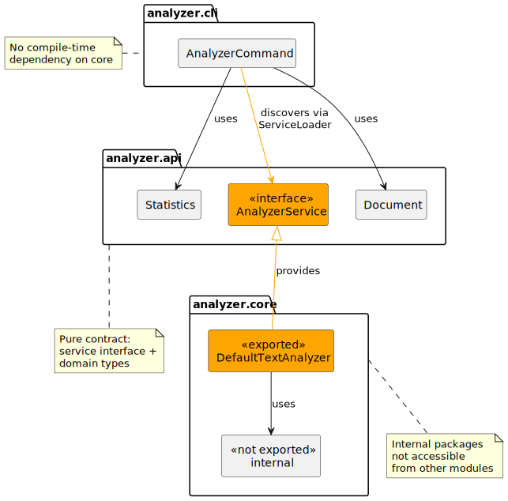

= Services — inversion of control with ServiceLoader
ifdef::env-github[]
:tip-caption: :bulb:
:note-caption: :information_source:
:important-caption: :heavy_exclamation_mark:
:caution-caption: :fire:
:warning-caption: :warning:
endif::[]
:author: Gerd Aschemann
:revdate: 2026-04-09
:source-highlighter: rouge
:icons: font

[.lead]
The xref:04-api-and-implementation.adoc[previous article] separated the domain types into an API module and used `requires transitive` to keep the wiring convenient.
The command-line module still directly instantiates `TextAnalyzer` from the core module — coupling the consumer to the implementation.
Java Modules provide a built-in mechanism to break this coupling: the _Service Provider Interface_ pattern with `ServiceLoader`.

== The problem: Compile-time coupling

After the previous article, the command-line module's dependency graph looks like this:

----
cli ──requires──▶ core ──requires transitive──▶ api
----

The command-line module imports `TextAnalyzer` directly:

[source,java]
----
TextAnalyzer analyzer = new TextAnalyzer(topWords);
Statistics stats = analyzer.analyze(document);
----

This means the command-line module _must_ depend on the core module at compile time.
It cannot work with the API types alone — it needs to know the concrete implementation class.

This design couples consumers to implementations.
Swapping, decorating, or testing with a different analyzer requires changes to the command-line code.

== The service provider interface pattern

Java Modules solve this with three building blocks:

`uses`:: A module declares that it _consumes_ a service interface.
`provides ... with`:: A module declares that it _provides_ an implementation of a service interface.
`ServiceLoader`:: The runtime API that discovers and loads service implementations from the module path.

The key insight: the consumer and the provider never need to know about each other.
They both depend on the _contract_ — the service interface in the API module — and the module system wires them together at runtime.

The dashed lines show runtime relationships: the command-line module _discovers_ the `AnalyzerService` via `ServiceLoader`, and the core module _provides_ the implementation.
Neither module references the other directly.

== Step 1: Define the service interface

The new `AnalyzerService` interface goes into the API module.
It defines the contract that any implementation must fulfill.

[source,java]
----
/**
 * Service interface for text analysis.
 * Implementations are discovered at runtime via {@link java.util.ServiceLoader}.
 */
public interface AnalyzerService {

    /**
     * Analyzes the given document and returns statistics.
     *
     * @param document the document to analyze
     * @return the analysis statistics
     */
    Statistics analyze(Document document);
}
----

The interface declares a single method: `analyze(Document)`.
It contains no discovery logic — the API module stays a pure contract with no dependencies.

The API module descriptor remains unchanged from the previous article:

[source,java]
----
module net.aschemann.maven.demos.analyzer.api {
    exports net.aschemann.maven.demos.analyzer.api; // <1>
}
----

It exports the API package — nothing more.

== Step 3: Provide the implementation

The `TextAnalyzer` class from the previous article becomes `DefaultTextAnalyzer` and implements the `AnalyzerService` interface:

[source,java]
----
/**
 * Default implementation of {@link AnalyzerService}.
 * Provides comprehensive text analysis with word frequency tracking.
 */
public class DefaultTextAnalyzer implements AnalyzerService { // <1>

    private static final Logger LOG = LogManager.getLogger(DefaultTextAnalyzer.class);

    private static final int DEFAULT_TOP_WORDS_LIMIT = 10;

    private final int topWordsLimit;

    public DefaultTextAnalyzer() {
        this(DEFAULT_TOP_WORDS_LIMIT);
    }

    public DefaultTextAnalyzer(int topWordsLimit) {
        this.topWordsLimit = topWordsLimit;
    }

    @Override // <2>
    public Statistics analyze(Document document) {
        LOG.info("Analyzing document: {}", document.path());

        String content = document.content();
        String[] lines = content.split("\\R");
        long lineCount = lines.length;

        String[] words = TextNormalizer.tokenize(content);
        long wordCount = words.length;

        long characterCount = content.length();
        long characterCountWithoutSpaces = content.chars()
                .filter(c -> !Character.isWhitespace(c))
                .count();

        Map<String, Long> wordFrequencies = Arrays.stream(words)
                .filter(word -> !word.isEmpty())
                .collect(Collectors.groupingBy(Function.identity(), Collectors.counting()));

        List<Map.Entry<String, Long>> topWords = wordFrequencies.entrySet().stream()
                .sorted(Map.Entry.comparingByValue(Comparator.reverseOrder()))
                .limit(topWordsLimit)
                .toList();

        LOG.debug("Analysis complete: {} lines, {} words, {} characters",
                lineCount, wordCount, characterCount);

        return new Statistics(
                document,
                lineCount,
                wordCount,
                characterCount,
                characterCountWithoutSpaces,
                wordFrequencies,
                topWords
        );
    }
----
<1> The class now implements the `AnalyzerService` interface
<2> The `analyze` method fulfills the service contract

The implementation remains otherwise unchanged — it still uses the internal `TextNormalizer` from the xref:03-encapsulation.adoc[encapsulation article].

=== The updated core module descriptor

[source,java]
----
module net.aschemann.maven.demos.analyzer.core {
    requires transitive net.aschemann.maven.demos.analyzer.api; // <1>
    requires org.apache.logging.log4j; // <2>

    exports net.aschemann.maven.demos.analyzer.core.service; // <3>
    // Note: net.aschemann.maven.demos.analyzer.core.internal is NOT exported

    provides net.aschemann.maven.demos.analyzer.api.AnalyzerService
        with net.aschemann.maven.demos.analyzer.core.service.DefaultTextAnalyzer; // <4>
}
----
<1> Transitive dependency on the API module — unchanged
<2> Log4j for internal logging — unchanged
<3> Export the service package — consumers _can_ use `DefaultTextAnalyzer` directly if they choose
<4> Declare that this module provides an implementation of `AnalyzerService`

The `provides ... with` directive serves as the counterpart to `uses`.
It tells the module system: "when someone asks for an `AnalyzerService`, a `DefaultTextAnalyzer` stands ready."

== Step 4: Update the command-line module — no more core dependency

This step shows the payoff.
The command-line module now depends _only_ on the API and discovers the implementation at runtime via `ServiceLoader`:

[source,java]
----
module net.aschemann.maven.demos.analyzer.cli {
    requires net.aschemann.maven.demos.analyzer.api; // <1>
    requires info.picocli;
    requires org.apache.logging.log4j;

    uses net.aschemann.maven.demos.analyzer.api.AnalyzerService; // <2>

    opens net.aschemann.maven.demos.analyzer.cli to info.picocli;
}
----
<1> The command-line module requires only the API module — not the core module
<2> The `uses` directive declares that this module discovers `AnalyzerService` implementations via `ServiceLoader`

The `uses` directive must appear in the module that calls `ServiceLoader.load()`.
Without it, the `ServiceLoader` finds no implementations, even if they exist on the module path.

The `AnalyzerCommand` now calls `ServiceLoader` directly instead of instantiating `TextAnalyzer`:

[source,java]
----
    @Override
    public Integer call() {
        try {
            String content = Files.readString(file, StandardCharsets.UTF_8); // <1>
            Document document = new Document(file, content);

            AnalyzerService analyzer = ServiceLoader.load(AnalyzerService.class) // <2>
                    .findFirst()
                    .orElseThrow(() -> new IllegalStateException(
                            "No AnalyzerService implementation found on the module path"));

            Statistics stats = analyzer.analyze(document); // <3>

            printResults(stats);
            return 0;

        } catch (IOException e) {
            System.err.println("Error reading file: " + e.getMessage());
            return 1;
        }
    }
----
<1> Read the file directly — no more `DocumentReader` dependency needed
<2> Discover the analyzer via `ServiceLoader` at runtime
<3> Use the service interface — the command-line module has no idea which implementation it gets

The command-line module no longer imports anything from the core module.
It works entirely through the API contract.

== How `ServiceLoader` discovery works

When the command-line module calls `ServiceLoader.load(AnalyzerService.class)`, the following happens:

. The runtime scans all modules on the module path
. It finds modules that declare `provides AnalyzerService with ...`
. It instantiates the declared implementation class using its no-argument constructor
. It returns the instance to the caller

The runtime defers loading implementations until iterated over or until `findFirst()` runs.

== The decoupled architecture

Compare the module graphs before and after:

.Before — API and implementation separation
----
cli ──requires──▶ core ──requires transitive──▶ api
----

.After — services with `ServiceLoader`
----
cli ──requires──▶ api ◀──requires transitive── core
                        ◀──provides──────────── core (runtime only)
----

The arrow between the command-line module and the core has disappeared.
The core module now serves as a _runtime-only_ dependency.
It must exist on the module path when running, but the command-line module does not reference it at compile time.

This represents _inversion of control_: the consumer depends on an abstraction — the service interface — and the module system injects the implementation at runtime.

== Build and run

Build and run the project as before:

[source,bash]
----
./mvnw compile
./mvnw prepare-package
----

[source,bash,attrs=+callouts]
----
java --module-path "target/classes:target/lib" \#<1>
     --module net.aschemann.maven.demos.analyzer.cli/net.aschemann.maven.demos.analyzer.cli.AnalyzerCommand \
     README.adoc
----
<1> The core module must still exist on the module path — `ServiceLoader` needs it at runtime

Even though the command-line module does not `requires` the core module, that module must remain present on the module path.
Otherwise, `ServiceLoader` finds no implementation and `findFirst()` returns an empty `Optional`.

== Source Code

The above changes are commited to the sample source code repository on https://github.com/aschemaven/maven-modular-sources-showcases[GitHub].
Clone it and switch to branch `blog-4-services`:

[source,bash]
----
git clone https://github.com/aschemaven/maven-modular-sources-showcases # unless already done
cd maven-modular-sources-showcases
git checkout blog-4-services
----

== Summary

This article covered:

* The `uses` directive declares service consumption in a module
* The `provides ... with` directive registers a service implementation
* `ServiceLoader` discovers implementations at runtime without compile-time coupling
* The command-line module now depends only on the API module — true inversion of control
* The implementation becomes a _runtime-only_ dependency, injected by the module system

This pattern forms the foundation for plugin architectures in Java.
Any module can provide an `AnalyzerService` implementation, and the command-line module discovers it automatically — no code changes required.

.Alternatives for decoupling contract and implementation
****
The Service Provider Interface pattern with `ServiceLoader` and Java Modules represents one point on a broader spectrum of decoupling strategies.

Manual dependency injection::
The caller passes the implementation via constructor or setter.
Lightweight and framework-free, but the wiring code must live somewhere — typically in a `main` method or a composition root.

Factory pattern::
A factory class or method creates the implementation.
This centralizes instantiation, but some part of the codebase still needs compile-time knowledge of the concrete class.

`ServiceLoader` on the class path::
The same `ServiceLoader` mechanism exists since Java 6, using `META-INF/services/` files instead of `module-info.java` directives.
It works without modules but lacks compile-time validation — a missing or misspelled provider file only shows up at runtime.

Dependency injection frameworks::
Spring, Jakarta Contexts and Dependency Injection, Google Guice, and Dagger provide full inversion-of-control containers with annotation-based wiring, lifecycle management, and scopes.
They bring great power but also add significant complexity and framework coupling.

OSGi service registry::
A full dynamic module system with versioned bundles and runtime install/uninstall.
Capable but heavyweight — and for most use cases now superseded by Java Modules.

The modular `ServiceLoader` approach shown in this article sits in a sweet spot.
It requires zero external dependencies, offers compile-time verification of the `uses`/`provides` contract, and integrates seamlessly with the module system's encapsulation guarantees.
****

== Homework

Add a second implementation::
Create a `net.aschemann.maven.demos.analyzer.simple` module with a `SimpleTextAnalyzer` that counts only words and lines — no frequencies.
Register it with `provides` and use `getAllInstances()` to run both analyzers on the same document.
What happens if two modules provide the same service?

Remove the core module from the module path::
Run the app without the core module on the module path.
What error message appears?
How does the `Optional` from `findFirst()` help compared to a `NullPointerException`?

Move discovery into the interface::
Add static factory methods `getInstance()` and `getAllInstances()` to the `AnalyzerService` interface that call `ServiceLoader.load()` internally.
What changes in the module descriptors?
Which module needs the `uses` directive now — and why?

'''

Apache Maven and Maven are trademarks of the https://www.apache.org/[Apache Software Foundation].
